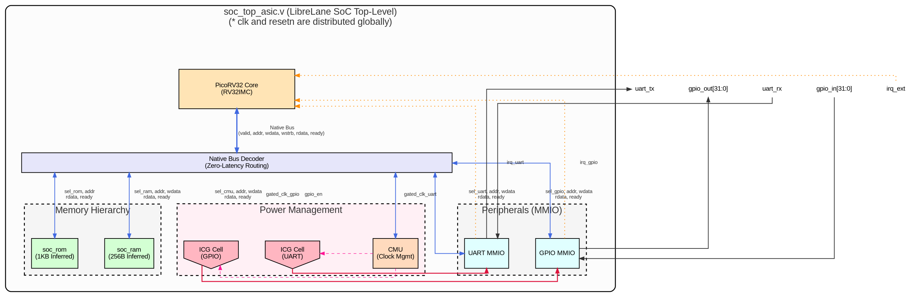

# Sơ đồ Kiến trúc và Tín hiệu của LibreLane SoC (Low-Power)

Dưới đây là sơ đồ kiến trúc tổng thể (Architecture Block Diagram) của con chip LibreLane SoC. Sơ đồ này thể hiện rõ dòng chảy dữ liệu (Data path), dòng xung nhịp (Clock path) và các cơ chế quản lý năng lượng (Power Management).

## 1. Sơ đồ Kiến trúc Tổng thể

*(Bản vẽ tĩnh được xuất tự động ở định dạng chuẩn Datasheet công nghiệp)*

---

## 2. Giải thích Chi tiết các Tín hiệu Giao tiếp

Hệ thống của chúng ta sử dụng một giao thức tự chế cực kỳ tinh gọn gọi là **Native Memory Interface**. Nó không cồng kềnh như AXI hay AHB mà chỉ dùng đúng 6 cụm tín hiệu để các linh kiện "nói chuyện" với nhau:

### A. Tín hiệu từ CPU gửi đi (Master)
*   **`mem_addr [31:0]`**: Tín hiệu Địa chỉ. CPU báo cho toàn hệ thống biết nó muốn đọc/ghi vào ô nhớ hoặc thanh ghi ngoại vi nào (VD: `0x20000000` là UART).
*   **`mem_valid`**: Tín hiệu Yêu cầu. Khi lên mức `1`, CPU hét lên: *"Tôi có một lệnh đọc/ghi hợp lệ cần xử lý!"*.
*   **`mem_wdata [31:0]`**: Dữ liệu Ghi. Nếu là lệnh Ghi (Write), CPU sẽ đặt giá trị cần ghi lên đường dây này.
*   **`mem_wstrb [3:0]`**: Tín hiệu Phân luồng (Write Strobe). Báo cho bộ nhớ biết CPU muốn ghi cả 32-bit (4 bytes), hay chỉ ghi 1 byte lẻ. Nếu đọc dữ liệu, tín hiệu này bằng `0000`.

### B. Tín hiệu từ Ngoại vi/Bộ nhớ phản hồi lại (Slave)
*   **`mem_rdata [31:0]`**: Dữ liệu Đọc. Nếu là lệnh Đọc (Read), ROM/RAM hoặc Ngoại vi sẽ đặt dữ liệu lấy được lên đường dây này để nạp lại vào CPU.
*   **`mem_ready`**: Tín hiệu Hoàn tất. Khi linh kiện xử lý xong yêu cầu, nó bật tín hiệu này lên `1`. CPU thấy `ready=1` sẽ biết là lệnh đã xong và lập tức chuyển sang chu kỳ máy tiếp theo. Nhờ vậy, hệ thống đạt được độ trễ cực thấp (Zero-Latency).

### C. Tín hiệu Mạng Xung nhịp (Clock Network)
*   **`clk`**: Xung nhịp gốc liên tục không ngừng nghỉ. Được cấp thẳng cho CPU, Bộ nhớ và CMU.
*   **`gated_clk`**: Xung nhịp đã bị "Cắt" bởi cổng ICG. Chỉ khi `clk_en = 1` thì xung nhịp mới được đi vào cấp điện cho UART và GPIO. Nếu `clk_en = 0`, UART và GPIO sẽ chết lâm sàng để tiết kiệm 100% điện năng động.

### D. Tín hiệu Ngắt (Interrupts)
*   **`irq`**: Đường dây cấp báo khẩn cấp. Khi người dùng gõ bàn phím (UART RX) hoặc bấm nút (GPIO), tín hiệu IRQ sẽ báo thẳng vào lõi CPU để CPU tạm dừng việc đang làm và chạy chương trình xử lý sự kiện ngay lập tức.

---
> 💡 **Khuyến nghị cho Báo cáo:** Bạn có thể copy đoạn mã Mermaid ở trên và dán vào các trình render như `mermaid.live` hoặc draw.io để xuất ra file ảnh nét căng dán vào slide báo cáo của mình. Cấu trúc này là một minh chứng hoàn hảo cho một thiết kế **SoC hướng đến Low-Power và Độ trễ cực thấp**.
